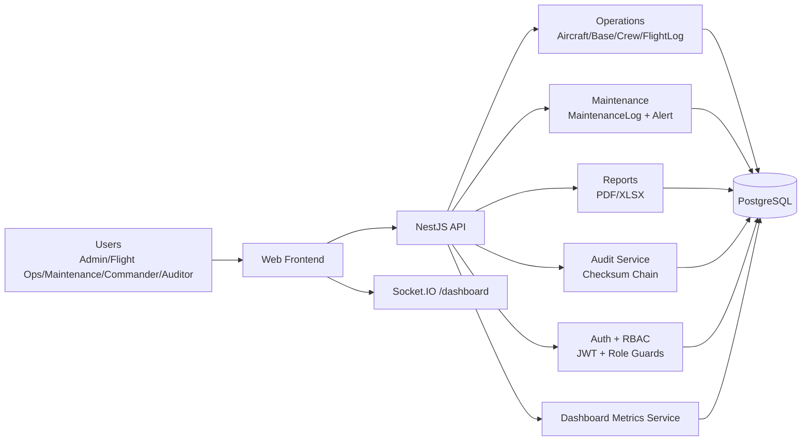

# Architecture (NestJS Methodology)

```mermaid
flowchart LR
  U[Users\nAdmin/Flight Ops/Maintenance/Commander/Auditor] --> FE[Web Frontend]
  FE --> API[NestJS API]
  FE --> WS[Socket.IO /dashboard]

  API --> AUTH[Auth + RBAC\nJWT + Role Guards]
  API --> OPS[Operations\nAircraft/Base/Crew/FlightLog]
  API --> MAINT[Maintenance\nMaintenanceLog + Alert]
  API --> REP[Reports\nPDF/XLSX]
  API --> AUD[Audit Service\nChecksum Chain]
  API --> DASH[Dashboard Metrics Service]

  OPS --> DB[(PostgreSQL)]
  MAINT --> DB
  REP --> DB
  AUD --> DB
  AUTH --> DB
  DASH --> DB
```
