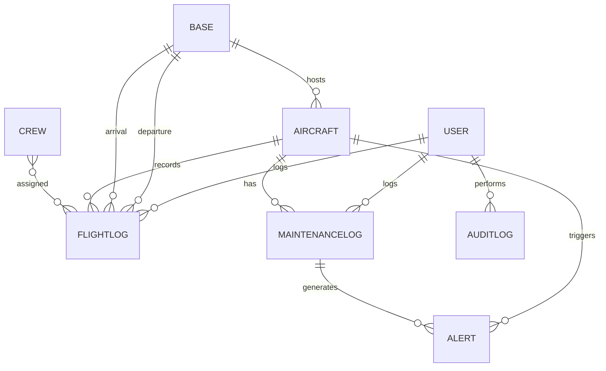

# ER Diagram (Prisma)

```mermaid
erDiagram
  USER ||--o{ FLIGHTLOG : logs
  USER ||--o{ MAINTENANCELOG : logs
  USER ||--o{ AUDITLOG : performs

  BASE ||--o{ AIRCRAFT : hosts
  BASE ||--o{ FLIGHTLOG : departure
  BASE ||--o{ FLIGHTLOG : arrival

  AIRCRAFT ||--o{ FLIGHTLOG : records
  AIRCRAFT ||--o{ MAINTENANCELOG : has
  AIRCRAFT ||--o{ ALERT : triggers

  MAINTENANCELOG ||--o{ ALERT : generates
  CREW }o--o{ FLIGHTLOG : assigned
```
