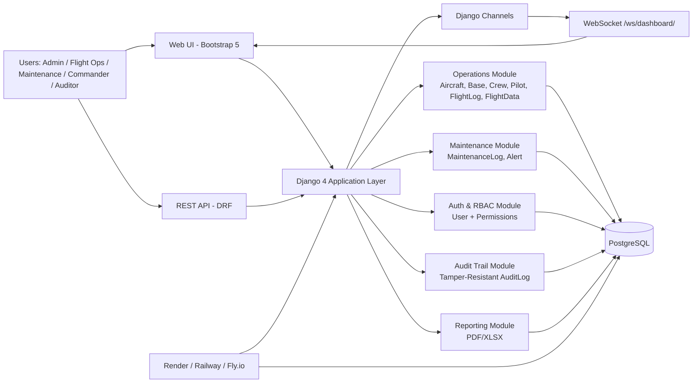

# Architecture Diagram

```mermaid
flowchart LR
    U[Users: Admin / Flight Ops / Maintenance / Commander / Auditor] --> W[Web UI - Bootstrap 5]
    U --> A[REST API - DRF]
    W --> D[Django 4 Application Layer]
    A --> D

    D --> O[Operations Module\nAircraft, Base, Crew, Pilot, FlightLog, FlightData]
    D --> M[Maintenance Module\nMaintenanceLog, Alert]
    D --> AU[Auth & RBAC Module\nUser + Permissions]
    D --> AT[Audit Trail Module\nTamper-Resistant AuditLog]
    D --> R[Reporting Module\nPDF/XLSX]

    D --> C[Django Channels]
    C --> WS[WebSocket /ws/dashboard/]
    WS --> W

    O --> DB[(PostgreSQL)]
    M --> DB
    AU --> DB
    AT --> DB
    R --> DB

    Cloud[Render / Railway / Fly.io] --> D
    Cloud --> DB
```
