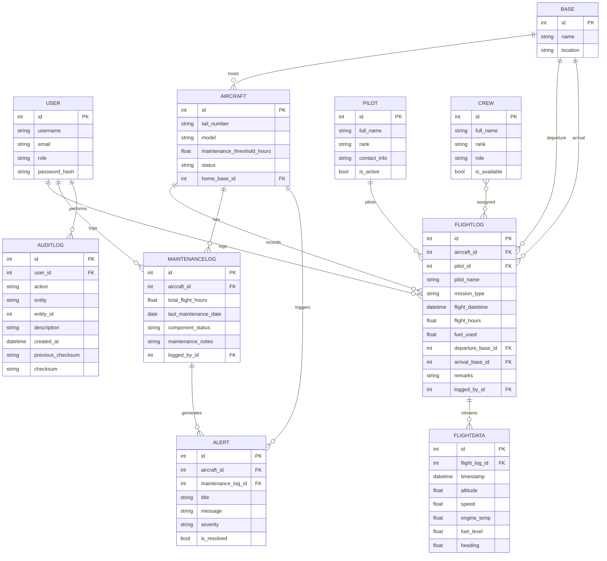

# ER Diagram

```mermaid
erDiagram
    USER ||--o{ FLIGHTLOG : logs
    USER ||--o{ MAINTENANCELOG : logs
    USER ||--o{ AUDITLOG : performs

    BASE ||--o{ AIRCRAFT : hosts
    BASE ||--o{ FLIGHTLOG : departure
    BASE ||--o{ FLIGHTLOG : arrival

    PILOT ||--o{ FLIGHTLOG : pilots
    AIRCRAFT ||--o{ FLIGHTLOG : records
    AIRCRAFT ||--o{ MAINTENANCELOG : has
    AIRCRAFT ||--o{ ALERT : triggers

    FLIGHTLOG ||--o{ FLIGHTDATA : streams
    MAINTENANCELOG ||--o{ ALERT : generates

    CREW }o--o{ FLIGHTLOG : assigned

    USER {
      int id PK
      string username
      string email
      string role
      string password_hash
    }

    AIRCRAFT {
      int id PK
      string tail_number
      string model
      float maintenance_threshold_hours
      string status
      int home_base_id FK
    }

    BASE {
      int id PK
      string name
      string location
    }

    CREW {
      int id PK
      string full_name
      string rank
      string role
      bool is_available
    }

    PILOT {
      int id PK
      string full_name
      string rank
      string contact_info
      bool is_active
    }

    FLIGHTLOG {
      int id PK
      int aircraft_id FK
      int pilot_id FK
      string pilot_name
      string mission_type
      datetime flight_datetime
      float flight_hours
      float fuel_used
      int departure_base_id FK
      int arrival_base_id FK
      string remarks
      int logged_by_id FK
    }

    FLIGHTDATA {
      int id PK
      int flight_log_id FK
      datetime timestamp
      float altitude
      float speed
      float engine_temp
      float fuel_level
      float heading
    }

    MAINTENANCELOG {
      int id PK
      int aircraft_id FK
      float total_flight_hours
      date last_maintenance_date
      string component_status
      string maintenance_notes
      int logged_by_id FK
    }

    ALERT {
      int id PK
      int aircraft_id FK
      int maintenance_log_id FK
      string title
      string message
      string severity
      bool is_resolved
    }

    AUDITLOG {
      int id PK
      int user_id FK
      string action
      string entity
      int entity_id
      string description
      datetime created_at
      string previous_checksum
      string checksum
    }
```
